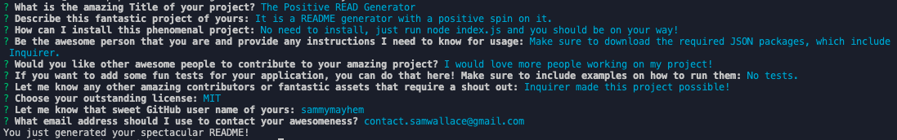
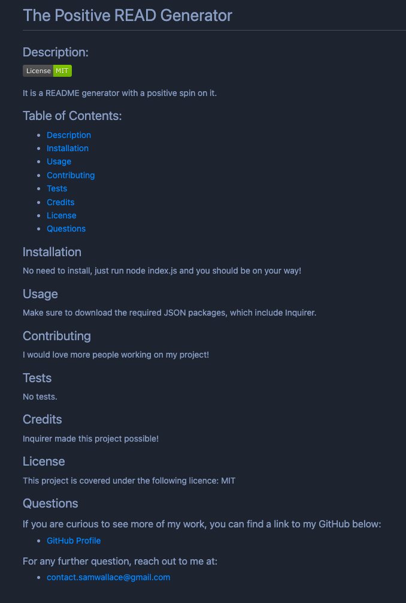

# Positive README Generator

## Description
Greetings you awesome individual and welcome to the Positive README Generator. I don't know about you, but creating a well crafted README can be a challenge sometimes. That's why I created the this project, I wanted to add a little spice to the process of creating a README. With the Positive README Generator you will be prompted with questions to help us build your positively fantastic README. I hope you enjoy and know that your project is amazing!

## Link to Video Demonstration

https://drive.google.com/file/d/1YXLftQUo4oof3Y5kMtM3I86swjFzdJM4/view

## Screenshot

## Questions?

### Check out some of my other awesome projects below:
    - [GitHub Profile](https://github.com/sammymayhem)

### If you have more questions you can contact me at:
    - contact.samwallace@gmail.com